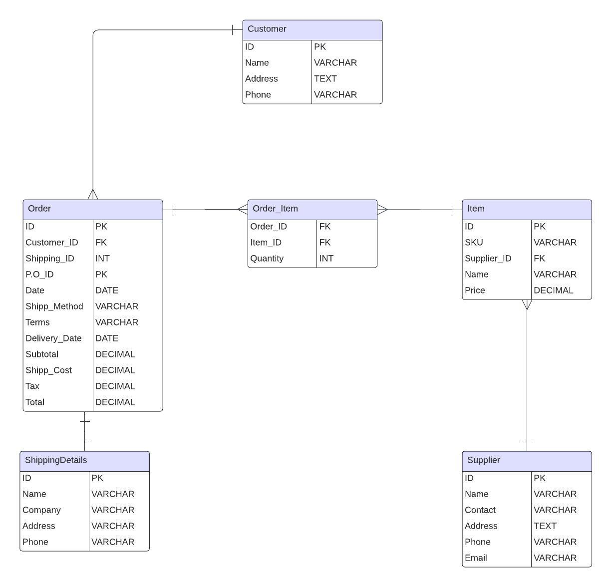

# Order Purchase System

## Project Overview
The EDI 850 is a purchase order sent from a buyer to a seller requesting goods or services. 
The API will support operations such as `Get` and `Post` to manage orders,
customer, items, suppliers, and shipping details as it is depicted in the EDI 850 purchase order.
The RESTful API will be built with Spring Boot and MySQL for persistance.
--------------
## Requirements
 - **API Operations:**
   - `Get`: Retrieve data from the database.
   - `Post`: Create and persist data to the database.
 - **Database:** MySQL
 - **Framework**: Spring Boot
 - **Validation:** Input validation
-----
## Database Schema and Relationships
 

### The ER depicted above shows the relationship between different entities:
- A single `Customer` entity can have many `Order` entities.
- A single `Order` entity can have many Shipping orders.
- Many `Order` entities can have many Items.
- A single `Supplier` entity can supply many `Item` entities.
-----
## API Endpoints

### Customer:

- GET `/customers`: Retrieve a list of all customers.
- GET `/customers/{id}`: Retrieve details of a specific customer by ID.
- POST `/customers`: Add a new customer.

### Order:
- GET `/orders`: Retrieve a list of all orders.
- GET `/orders/{id}`: Retrieve details of a specific order by ID.
- POST `/orders`: Create a new order.

### Item

- GET `/items`: Retrieve a list of all items.
- GET `/items/{id}`: Retrieve details of a specific item by ID.
- POST `/items`: Add a new item.

### Supplier

- GET `/suppliers`: Retrieve a list of all suppliers.
- GET `/suppliers/{id}`: Retrieve details of a specific supplier by ID.
- POST `/suppliers`: Add a new supplier.

### ShippingDetails

- GET `/shippingDetails`: Retrieve a list of all shipping details.
- GET `/shippingDetails/{id}`: Retrieve details of a specific shipping detail record by ID.
- POST `/shippingDetails`: Add a new shipping detail.
----
##  Development Plan

1. **Setup Project.**
   - Create a Spring Boot project with Spring Initializr.
   - Add dependencies such as Spring Web, Spring Data JPA, MySQL driver.
2. **Define Entities.**
   - Create `Customer`, `Order`, `Product`, `Supplier`, and `ShippingDetails`entities.
3. **Create Repositories/Data Access Layer.**
   - Define JPA Repos for accessing entities.
4. **Create Service Layer.**
   - Implement service classes to handle business logic.
5. **Create Controller Layer.**
   - Build controllers for `GET` and `POST` endpoints.
6. **Configure MySQL.**
   - Set up and configure MySQL database.
7. **Test Endpoints.**
   - Use tools such as Postman to test endpoints.
8. **Present Project.**
   - Present project to interviewer.
---
## Tools & Technologies
 - **Framework**: Spring Boot.
 - **Database**: MySQL.
 - **Testing**: Postman.
 - **VC**: GitHub.